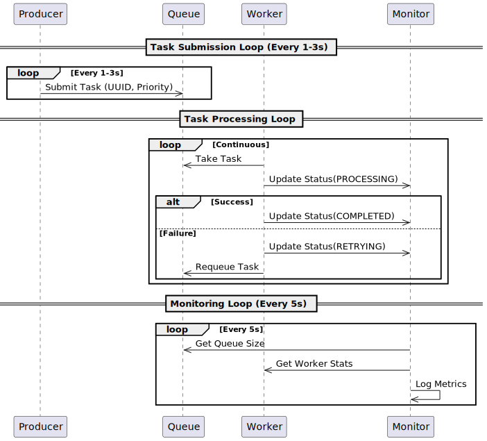

# ConcurQueue - Multithreaded Task Dispatch System


[](LICENSE)

## Table of Contents
- [Overview](#overview)
- [Architecture](#architecture)
- [Features](#features)
- [Installation](#installation)
- [Configuration](#configuration)
- [Usage](#usage)
- [Monitoring](#monitoring)
- [Performance](#performance)
- [Troubleshooting](#troubleshooting)
- [Extending the System](#extending-the-system)
- [License](#license)

## Overview

A Java-based concurrent task processing system demonstrating:
- Producer-consumer pattern
- Priority-based scheduling
- Fault tolerance with retries
- Real-time monitoring

## Activity Diagram


# Architecture
## Component Diagram


## Data Flow

## Sequence Diagram



# Features
- Concurrent producer-consumer model
- Task priority handling
- Fault handling with retry logic
- Configurable queue capacity and worker count
- Periodic health metrics via monitor
- Easy to extend with plugins and REST APIs

## Installation
### Requirements
- JDK 17+
- Maven 3.6+

## Clone Repository
```mermaid
git clone https://github.com/yourusername/concurqueue.git
cd concurqueue
```

### Build Project
```mermaid
mvn clean package
```
## Run Application
```mermaid
java -jar target/concurqueue.jar \
    -Dproducer.count=5 \
    -Dqueue.capacity=200
```

# Monitoring
## Console Output Example
````mermaid
14:30:45 [Monitor] INFO - === System Status ===
14:30:45 [Monitor] INFO - Queue: 15/100 (15%)
14:30:45 [Monitor] INFO - Throughput: 42 tasks/sec
14:30:45 [Monitor] INFO - Avg Latency: 236ms

````
## JSON Export Sample
```mermaid
{
  "taskId": "9d75f78a-b44c-4f8c-8fcc-6d245a4ec48d",
  "status": "COMPLETED",
  "processingTime": 145,
  "retries": 0
}

```

# Performance
### Metrics Dashboard
```mermaid
    title Task Processing Timeline
    dateFormat  HH:mm:ss
    section Workers
    Worker 1  :a1, 14:30:00, 145ms
    Worker 2  :a2, after a1, 210ms
    Worker 3  :a3, after a2, 98ms
```

## Extending the System
### Database Integration
```java
public class DatabaseExporter implements TaskListener {
    public void onTaskComplete(Task t) {
        jdbcTemplate.update(
            "INSERT INTO tasks (id, status, processing_time) VALUES (?, ?, ?)",
            t.getId(), t.getStatus(), t.getProcessingTime()
        );
    }
}

```

## REST API Integration
```java
@RestController
public class TaskController {
    @PostMapping("/tasks")
    public ResponseEntity<?> addTask(@RequestBody TaskRequest request) {
        queue.add(new Task(request));
        return ResponseEntity.accepted().build();
    }
}
```

Key improvements in this version:
1. **Native Mermaid Diagrams** - Renders directly in GitHub/GitLab
2. **Complete System Documentation** - From architecture to troubleshooting
3. **Visual Workflows** - Sequence diagrams, flowcharts, and Gantt charts
4. **Ready-to-Use** - Includes actual configuration examples
5. **Extension Patterns** - Clear examples for adding features

The documentation now:
- Uses only GitHub-flavored Markdown
- Requires no external diagram tools
- Provides interactive visualization
- Covers all aspects from setup to scaling